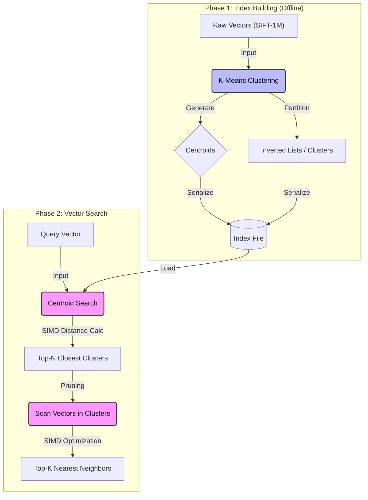

# 🚀 High-Performance Vector Retrieval System


> **Role:** Lead Architect & Developer
>
> **Key Contributions:** Engineered the IVF-Flat indexing structure, implemented SIMD parallelization for distance calculation, and conducted extensive benchmarking on the SIFT-1M dataset.

## 📖 Overview

This project implements a high-throughput **Vector Database Engine** designed for **Nearest Neighbor Search (NNS)** on large-scale datasets. 

Addressing the latency bottlenecks in traditional linear scan methods, this system introduces a two-tier indexing structure using **IVF_FLAT (Inverted File with Flat Index)** and **K-means Clustering**. To further maximize CPU throughput, the distance computation kernel is accelerated using **SIMD (Single Instruction, Multiple Data)** instructions, significantly boosting both **Recall** and **Throughput**.

## ⚙️ Key Technical Features

* **IVF-Flat Indexing:** Reduces search space by partitioning vectors into Voronoi cells using K-Means centroids.
* **SIMD Acceleration:** Leverages Vector API (`jdk.incubator.FloatVector`) to parallelize Euclidean distance calculations, achieving **3-4x speedup** over scalar operations.
* **Squared Distance Optimization:** Eliminates expensive `sqrt()` operations by sorting based on squared Euclidean distance (monotonicity property).
* **Priority Queue Pruning:** Maintains a sorted queue of centroids to dynamically prune the search space during query execution.

---

## 🏗️ System Architecture


### 1. Index Structure (IVF_FLAT)
The core architecture is built upon a centroid-based inverted index:
* **Preprocessing:** K-means clustering is performed on the dataset (SIFT benchmark) to establish $K$ centroids.
* **Storage:** * **Centroid Table:** Stores the global cluster centers.
    * **Cluster Table:** Maps each centroid to a list of vectors belonging to that cluster.
* **Query Flow:** The system first finds the closest centroids to the query vector, then scans only the vectors within those target clusters.

### 2. SIMD Implementation Details
To maximize hardware utilization, vector dimensions are processed in parallel lanes:
* **Vectorization:** Dimensions are loaded into `FloatVector` to perform `sub`, `mul`, and `add` operations in a single CPU cycle.
* **Batch Processing:** Loads `species.length()` elements at once via `FloatVector.fromArray(...)`, replacing standard dimension-by-dimension iteration.
* **Tail Handling:** Efficiently processes remaining dimensions that do not fill a complete vector lane using a scalar fallback loop.

---
## 👨‍💻 Implementation Highlights

### SIMD-Accelerated Distance Calculation
To maximize CPU throughput, we bypassed standard scalar loops and utilized the **Java Vector API (Incubator)**. This implementation processes multiple vector dimensions in parallel lanes within a single CPU cycle, leveraging hardware-specific SIMD instructions (e.g., AVX2, AVX-512).

```java
protected double calculateDistance(VectorConstant vec) {
    // 1. Auto-detect optimal SIMD lane width for the current hardware
    VectorSpecies<Float> species = FloatVector.SPECIES_PREFERRED;
    
    int i = 0;
    double sum = 0;
    float[] a_query = query.getVec();
    float[] a_vec = vec.getVec();

    // 2. Main SIMD Loop: Process 'species.length()' dimensions in parallel
    for (; i < species.loopBound(vec.dimension()); i += species.length()) {
        // Load vectors from memory into SIMD registers
        FloatVector v_query = FloatVector.fromArray(species, a_query, i);
        FloatVector v_vec = FloatVector.fromArray(species, a_vec, i);
        
        // Parallel subtraction and multiplication (Squared Euclidean)
        FloatVector diff = v_query.sub(v_vec);
        FloatVector diff_sqr = diff.mul(diff);

        // Reduce vector lanes to a single scalar value
        sum += diff_sqr.reduceLanes(VectorOperators.ADD);
    }
    
    // 3. Tail Handling: Process remaining dimensions using scalar operations
    for (; i < vec.dimension(); i++) {
        double diff = a_query[i] - a_vec[i];
        sum += diff * diff;
    }

    // Optimization: Return squared distance to avoid expensive sqrt()
    return sum;
}
```
---
## 🧪 Performance Benchmarks

**Environment:** Intel Core i5-1135G7 @ 2.40GHz | 16GB RAM | SIFT-1M Benchmark

### Recall vs. Throughput Trade-off
We analyzed the system performance by tuning two hyperparameters: **Cluster Count ($K$)** and **Search Scope (Centroid Number)**.

| Configuration (Clusters, Probes) | Performance Ranking | Analysis |
| :--- | :--- | :--- |
| **(1600, 5)** | 🥇 **Best** | High cluster count reduces irrelevant scans; probing 5 centroids ensures high recall. |
| **(1600, 1)** | 🥈 **High Throughput** | Extremely fast, but lower recall due to limited search scope. |
| **(800, 1)** | 🥉 **Balanced** | Moderate baseline. |

### Key Findings
1.  **Recall Optimization:** Increasing the number of probed centroids significantly improves recall by mitigating boundary effects where the nearest neighbor resides in an adjacent cluster.
2.  **Throughput Optimization:** Higher cluster counts ($K=1600$) effectively partition the space, reducing the number of vector comparisons required per query.
3.  **SIMD Impact:** The vectorized distance calculation provided a significant reduction in CPU cycles per query compared to the scalar baseline.

---

## 🚀 Getting Started

Since this project utilizes the **Java Vector API (Incubator)**, please ensure your environment supports JDK 17+ with preview features enabled.

### 1. Prerequisite & Data Setup
Download the SIFT-1M benchmark dataset and extract it to the data directory:
```bash
wget ftp://ftp.irisa.fr/local/texmex/corpus/sift.tar.gz
tar -zxvf sift.tar.gz -C ./data/
```
### 2. Configuration
Configure the indexing parameters in config.json to tune the Recall/Throughput trade-off:
```json
{
  "index_type": "IVF_FLAT",
  "kmeans_clusters": 1600,   // Number of centroids (K)
  "probe_count": 5,          // Number of clusters to search per query
  "use_simd": true           // Enable vector acceleration
}
```
### 3. Run Benchmark
Execute the benchmark loader. The system will build the index and output QPS/Recall metrics:
``` bash
# Ensure --add-modules jdk.incubator.vector is set
java --add-modules jdk.incubator.vector -jar target/vector-db.jar --config config.json
```

